# DataSeap 架构设计文档

## 1. 引言

DataSeap (Datasea P) 旨在提供一个统一、高效、可扩展的数据湖底座。本项目基于 StarRocks [1] 和 Elasticsearch [2] (其中 StarRocks 为主导数据分析与查询引擎)，并结合 Pulsar 等消息队列，构建一个强大的数据处理与分析核心。DataSeap 的核心目标是简化业务对底层数据湖构建和运维的复杂度，通过汇聚来自流量、终端等多源异构的数据，利用先进的分析引擎和 AI 能力，实现保障数据资产的安全、合规流转与价值释放。

本文档将详细阐述 DataSeap 的总体架构、核心模块设计、技术选型以及如何应对关键的业务需求与技术挑战。

## 2. 设计原则

DataSeap 的架构设计遵循以下核心原则：

* **高性能与实时性**: 优先保障交互式查询和实时数据分析的性能，满足事件型的秒级响应需求。
* **可扩展性**: 系统应能水平扩展，以适应日益增长的数据量和计算需求。
* **多场景融合与隔离**: 有效隔离不同类型的工作负载 (如实时查询、批量分析、数据导入)，避免资源争抢，保障关键业务的SLA。
* **标准化与易用性**: 提供统一的数据接入、查询和分析接口，降低上层业务应用的集成复杂度。
* **可观测性与可维护性**: 内建完善的监控、告警、日志和事件管理机制，简化运维。
* **开放性**: 基于开源组件构建，拥抱开源生态，易于扩展和定制。

## 3. 总体架构

DataSeap 采用分层架构，确保各模块职责清晰、易于维护和扩展。核心架构如下图所示：

<a href="./imgs/architecture.svg"">
  
</a>

上图展示了DataSeap的宏观架构。它主要由以下几个层面构成：

* **展现与接入层 (Presentation & Access Layer)**:
    * **统一API网关 (Unified API Gateway)**: 提供标准化的RESTful API，作为所有数据上报、查询、分析和管理请求的统一入口。负责请求路由、认证授权、速率限制等。
    * **运维管理前端 (Ops Admin UI)**: (可选) 为运维人员提供一个图形化界面，用于监控系统状态、管理集群配置、查看告警和日志等。

* **应用服务层 (Application Service Layer)**: 包含核心的业务逻辑和服务。
    * **数据上报服务 (Ingestion Service)**: 处理来自多源异构数据源的数据接入请求，进行初步校验、格式转换，并将数据推送到Pulsar消息队列。
    * **统一查询服务 (Unified Query Service)**: 接收来自API网关的查询请求，根据查询类型（点查、聚合、全文检索、日志检索等）和元数据信息，将请求分发到StarRocks或Elasticsearch。该服务将重点优化全文检索功能，实现跨表搜索并返回包含表名和字段名的结果。
    * **分析服务 (Analytics Service)**: 支持更复杂的分析场景，如密集聚合分析、历史数据回溯扫描。该服务将深度利用StarRocks的物化视图、CBO、索引等特性。
    * **工作负载管理服务 (Workload Management Service)**: 对接StarRocks的Workload Group机制，实现资源的动态分配、优先级调度和任务隔离，保障不同场景下的性能需求。
    * **数据管理服务 (Data Management Service)**: 负责StarRocks中表结构、分区、分桶、索引、物化视图等的管理和推荐。

* **数据抽象与访问层 (Data Abstraction & Access Layer)**: 封装对底层数据组件的直接访问，提供统一的接口供上层服务调用。
    * **StarRocks适配器**: 封装与StarRocks集群的交互逻辑，包括SQL执行、元数据查询、Workload Group配置等。
    * **Pulsar适配器**: 封装与Pulsar集群的交互逻辑，包括消息生产和消费。
    * **Elasticsearch适配器**: 封装与Elasticsearch集群的交互逻辑，主要用于辅助特定场景下的全文检索需求，但优先考虑在StarRocks中实现全文检索。

* **数据平台层 (Data Platform Layer)**: 底层核心数据存储和计算引擎。
    * **StarRocks集群**: 作为主要的OLAP引擎，承担实时点查/聚合、物化视图、页面查询、密集聚合分析和历史数据回溯扫描等任务。其内置的全文检索能力（倒排索引）是关键。
    * **Pulsar集群**: 作为高吞吐、低延迟的消息队列，用于解耦数据上报和数据入湖过程，提供数据缓冲和可靠传输。
    * **Elasticsearch集群**: (可选，作为补充) 在StarRocks全文检索尚不能完全覆盖的特定场景或对复杂文本处理有特殊要求时，可作为辅助搜索引擎。

* **运维管理平台 (Operations & Management Platform)**: 提供对整个DataSeap平台及其依赖组件的全面运维能力。
    * **监控服务**: 采集StarRocks、Pulsar、Elasticsearch以及DataSeap自身各服务的性能指标、健康状态等。
    * **告警服务**: 基于预设规则和监控数据，在出现异常时及时发出告警。
    * **日志服务**: 收集、存储和查询平台所有组件的日志，便于问题排查。
    * **事件中心**: 记录系统关键操作事件和状态变更事件，用于审计和溯源。
    * **生命周期管理**: 辅助完成StarRocks、Pulsar等集群的升级、扩缩容等操作（通过调用其原生管理接口或Operator）。

## 4. 核心业务流程与挑战应对

### 4.1 数据上报流程


<a href="./imgs/datareport.svg"">
  
</a>

数据从各类设备或系统通过统一API网关进入数据上报服务。服务进行必要的格式校验和初步转换后，将数据作为消息发送到Pulsar集群。StarRocks通过其Routine Load或Stream Load机制（或通过Flink/Spark等中间层消费Pulsar再写入）持续地从Pulsar消费数据并加载到相应的表中。

### 4.2 查询与分析流程

<a href="./imgs/query.svg"">
  
</a>


查询和分析请求同样通过API网关，根据请求特征分发到统一查询服务或分析服务。

* **多场景融合与隔离**:
    * **解决方案**: 核心依赖StarRocks的**Workload Group**机制。DataSeap的`工作负载管理服务`将根据请求类型（交互式查询、批量分析、数据导入、MV刷新等）和预设策略，将不同的查询和任务分配到不同的Workload Group中。每个Workload Group可以配置不同的CPU、内存资源上限和优先级。
    * 例如，为实时点查/日志检索配置高优先级、低`cpu_share`（但保证能抢占）的Workload Group；为密集聚合分析配置中等优先级、较高`cpu_share`的Workload Group；为历史数据回溯扫描配置低优先级、受限`cpu_share`的Workload Group。
* **多任务隔离性保障**:
    * **预期效果**: 通过`工作负载管理服务`对StarRocks Workload Group的精细化配置和动态调整，确保写入（Stream Load/Routine Load）、查询（交互式、批量）、分析（后台任务）之间的资源争抢得到有效控制。高优先级任务（如交互式查询）能获得足够的资源保障，低优先级任务（如批量分析、历史回溯）的影响被限制在可接受范围内。
* **用户体验优先 (保障交互式查询低延迟)**:
    * **解决方案**:
        1.  **Workload Group优先级**: 赋予交互式查询的Workload Group (如 `wg_interactive`) 最高的 `cpu_share` 和可能的抢占能力。设置合理的 `query_timeout` 防止长查询阻塞。
        2.  **查询优化 (CBO)**: DataSeap将充分利用StarRocks强大的CBO。统一查询服务可能会对用户输入的查询进行一些预处理或结构化，但最终的执行计划优化主要依赖StarRocks。运维平台将定期收集慢查询日志，辅助进行针对性优化。
        3.  **智能索引与物化视图**:
            * **分区 (Partitioning)**: `数据管理服务`将指导或自动（基于时间字段）对日志类事实表按时间（如日/小时）进行分区。查询时，`统一查询服务`或用户提供的查询条件需包含时间范围，以便StarRocks利用分区裁剪。
            * **分桶 (Bucketing)**: `数据管理服务`将根据字段基数和查询模式，推荐或配置合适的分桶键（如设备ID、用户ID等高基数列），确保数据均匀分布，提升并行处理效率。
            * **Bitmap Index**: 为低基数列（如日志级别`log_level`、事件类型`event_type`）创建Bitmap索引，加速过滤查询。
            * **倒排索引 (Inverted Index)**: 这是**全文检索性能提升的关键**。`数据管理服务`将为需要全文检索或模糊查询的文本字段（如原始日志`raw_log`、消息体`message_body`）创建倒排索引。`统一查询服务`在接收到全文检索请求时，会将其转换为StarRocks的 `MATCH_ANY` / `MATCH_ALL` 查询语法。StarRocks的倒排索引支持多种分词器 (standard, english, chinese等)，可以在建表或建索引时指定。
            * **异步物化视图 (MV)**: 对于固定的、高频的仪表盘统计和聚合查询模式，`数据管理服务`将创建异步物化视图。StarRocks会自动维护MV的增量更新，查询时智能路由到MV，实现预计算加速。

### 4.3 全文检索性能提升

* **需求**: 统一查询接口实现跨表全文搜索，返回结果包含表名和字段名，支持多语言分词器，召全率优先。
* **StarRocks实现方案**:
    1.  **统一查询接口**: `统一查询服务`提供一个专门的全文检索API端点。
    2.  **倒排索引**: 在StarRocks中，为所有可能涉及全文检索的表的文本字段（如`message`, `description`, `payload_text`等）创建倒排索引，并根据字段内容特点选择合适的分词器（如为中文字段选择`chinese`分词器）。
        ```sql
        -- 示例：为 example_log 表的 message 字段创建倒排索引，使用中文分词器
        CREATE INDEX idx_message_inverted ON example_log(message) USING INVERTED PROPERTIES("parser"="chinese");
        ```
    3.  **跨表查询逻辑**:
        * `统一查询服务`接收到关键词后，会查询元数据（或预配置的列表）获取所有包含已创建倒排索引的目标表及其相关字段。
        * 服务会为每个目标表构造类似如下的查询：
            ```sql
            SELECT 'table_name_A' AS source_table, 'field_name_X' AS source_field, col1, col2, field_name_X AS matched_content
            FROM table_name_A
            WHERE MATCH_ANY(field_name_X, 'keyword') -- 或者 MATCH_ALL
            UNION ALL
            SELECT 'table_name_A' AS source_table, 'field_name_Y' AS source_field, col1, col2, field_name_Y AS matched_content
            FROM table_name_A
            WHERE MATCH_ANY(field_name_Y, 'keyword')
            UNION ALL
            SELECT 'table_name_B' AS source_table, 'field_name_Z' AS source_field, col_a, col_b, field_name_Z AS matched_content
            FROM table_name_B
            WHERE MATCH_ANY(field_name_Z, 'keyword');
            -- ... 更多表的UNION ALL
            ```
        * 这种`UNION ALL`的方式可以将多个表的检索结果合并，并在结果中明确指出数据来源的表名和字段名。
        * 对于“召全率优先，准确率次之”的需求，`MATCH_ANY` 通常比 `MATCH_ALL` 更能保证召回。StarRocks的`MATCH`语法也支持更复杂的布尔查询和短语查询，可以按需调整。
    4.  **返回结果**: `统一查询服务`将聚合来自StarRocks的查询结果，确保每条记录都清晰标识其原始表名和匹配到的字段名。
    5.  **分词器支持**: StarRocks建倒排索引时支持指定分词器。DataSeap在通过`数据管理服务`创建或推荐索引时，会考虑字段的语言特性。

## 5. 部署架构

DataSeap及其依赖组件推荐在容器化环境中部署（如Kubernetes），以便于管理、伸缩和维护。

<a href="./imgs/deploy.svg"">
  
</a>


* **DataSeap 服务**: 无状态服务，可以部署多个Pod实例，通过Kubernetes Service实现负载均衡。
* **StarRocks**:
    * FE (Frontend) 节点: 至少3个Pod实例，保证高可用。FE元数据需要持久化存储。
    * BE (Backend) 节点: 多个Pod实例，负责数据存储和计算。BE数据需要持久化存储。StarRocks Operator可以简化其在K8s上的部署和管理。
* **Pulsar**:
    * Broker 节点: 多个Pod实例，无状态。
    * Bookie 节点: 多个Pod实例，负责消息持久化存储。Bookie数据需要持久化存储。
    * ZooKeeper: Pulsar依赖ZooKeeper进行元数据管理和协调。ZooKeeper数据需要持久化存储。Pulsar Operator可以简化部署。
* **Elasticsearch**: (如果使用) 同样部署为多个Pod实例，区分Master、Data等角色，数据需要持久化存储。Elasticsearch Operator (ECK) 可用于部署。
* **运维组件**: Prometheus、Grafana等监控组件也推荐部署在Kubernetes集群内。

## 6. 技术选型

* **核心数据引擎**: StarRocks [1] (OLAP, 全文检索, 数据湖分析)
* **消息队列**: Apache Pulsar (数据缓冲, 实时数据流)
* **辅助搜索引擎**: Elasticsearch [2] (可选, 特定场景补充)
* **DataSeap后端开发语言**: Go (高性能, 并发友好, 丰富的生态)
* **DataSeap前端开发框架**: (可选UI) Vue.js / React
* **容器化与编排**: Docker, Kubernetes
* **监控与告警**: Prometheus, Grafana, Alertmanager
* **日志管理**: ELK Stack (Elasticsearch, Logstash, Kibana) 或 EFK Stack (Elasticsearch, Fluentd, Kibana) 用于DataSeap及组件自身日志。

## 7. 未来展望

* **增强AI/ML能力集成**: 更紧密地集成机器学习框架，支持在DataSeap之上构建和运行行业领域的AI模型（如UEBA、攻击意图识别等）。
* **智能化运维**: 引入AIOps理念，实现更智能的告警、故障自愈和资源优化。
* **数据血缘与治理**: 完善数据血缘追踪和数据治理能力，满足合规审计要求。
* **Serverless查询**: 探索基于Serverless架构的查询与分析能力，进一步优化资源利用率和成本。

## 8. 参考资料

- [1] StarRocks Project. *The world's fastest open query engine for sub-second analytics both on and off the data lakehouse.* GitHub. [https://github.com/StarRocks/starrocks](https://github.com/StarRocks/starrocks)
- [2] Elastic. *Free and Open Source, Distributed, RESTful Search Engine.* GitHub. [https://github.com/elastic/elasticsearch](https://github.com/elastic/elasticsearch)
